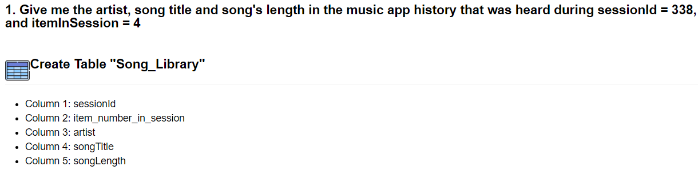
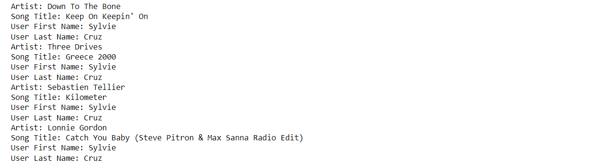
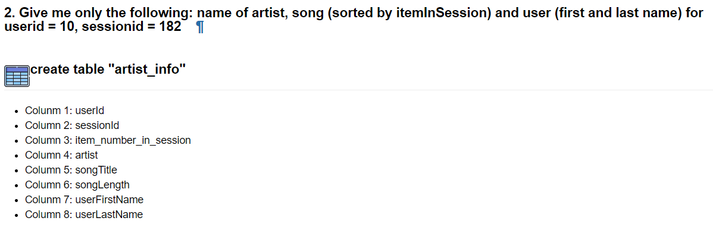
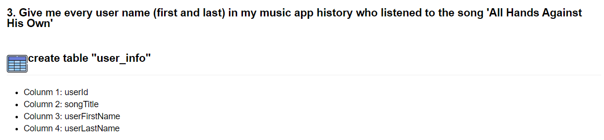
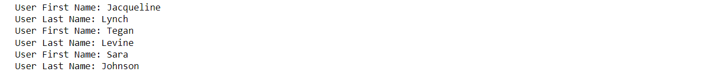
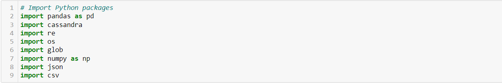

# Project: Data Modeling with Apache Cassandra

## Abstract
Analyzing the songs of Sparkify by applying data modelling with Apache Cassandra and building an ETL pipeline that transfers data from a set of CSV files within a directory to create a streamlined CSV file to model and insert data into Apache Cassandra tables.

## Introduction
A startup called Sparkify wants to analyze the data they've been collecting on songs and user activity on their new music streaming app. The analysis team is particularly interested in understanding what songs users are listening to. Currently, there is no easy way to query the data to generate the results, since the data reside in a directory of CSV files on user activity on the app.

They'd like a data engineer to create an Apache Cassandra database that can create queries on song play data to answer the questions. Our role is to create a database for this analysis. We would be able to test our database by running queries given to ours by the analytics team from Sparkify to create the results.

## problem Definition
In this project, We'll apply data modeling with Apache Cassandra and build an ETL pipeline using Python. To complete the project, We need to model our data by creating tables in Apache Cassandra to run queries. We are provided with part of the ETL pipeline that transfers data from a set of CSV files within a directory to create a streamlined CSV file to model and insert data into Apache Cassandra tables.

## Song Dataset

In this project, we would be working with one dataset: "event_data". The directory of CSV files partitioned by date. Here are examples of filepaths to two files in the dataset:

        event_data/2018-11-08-events.csv
        event_data/2018-11-09-events.csv

## Project Template
In addition to the data files, there ara a Jupyter notebook file:

- We process the event_datafile_new.csv dataset to create a denormalized dataset.
- We model the data tables keeping in mind the queries ours need to run.
- we have been provided queries that model our data tables.
- We load the data into tables to create in Apache Cassandra and run our queries.

## Implementation

### Modeling our NoSQL database or Apache Cassandra database

1. We designed tables to answer the queries outlined in the project template.
2. We Wrote Apache Cassandra CREATE KEYSPACE and SET KEYSPACE statements.
3. We developed our CREATE statement for each of the tables to address each question.
4. We loaded the data with INSERT statement for each of the tables.
5. We used  IF NOT EXISTS clauses in our CREATE statements to create tables only if the tables do not already exist. We used DROP TABLE statement for each table, this way we can run drop and create tables whenever to reset our database and test our ETL pipeline.
6. We tested by running the proper select statements with the correct WHERE clause

### Build ETL Processes
1. We implemented the logic in section Part I of the notebook template to iterate through each event file in event_data to process and create a new CSV file in Python.
2. We Made necessary edits to Part II of the notebook template to include Apache Cassandra CREATE and INSERT statements to load processed records into relevant tables in our data model.
3. We tested by running SELECT statements after running the queries on your database.

## Files

#### Project_1B_Project_Template.ipynb: 
This was template file provided to fill in the details and write the python script

### Final_Project_1B_ApacheCassandra.ipynb:
 This is the final file provided in which all the queries have been written with importing the files, generating a new csv file and loading all csv files into one. All verifying the results whether all tables had been loaded accordingly as per requirement

### Event_datafile_new.csv: 
This is the final combination of all the files which are in the folder event_data

### Event_Data Folder: 
Each event file is present separately, so all the files would be combined into one into event_datafile_new.csv

 

## -->Answer the following three questions of the data:

Answer :

Answer :

Answer :

## Tools
 - juputer notebook
 - Python27
 - thrift-0.16.0
 - apache-cassandra-3.11.14

## Python Libraries 

