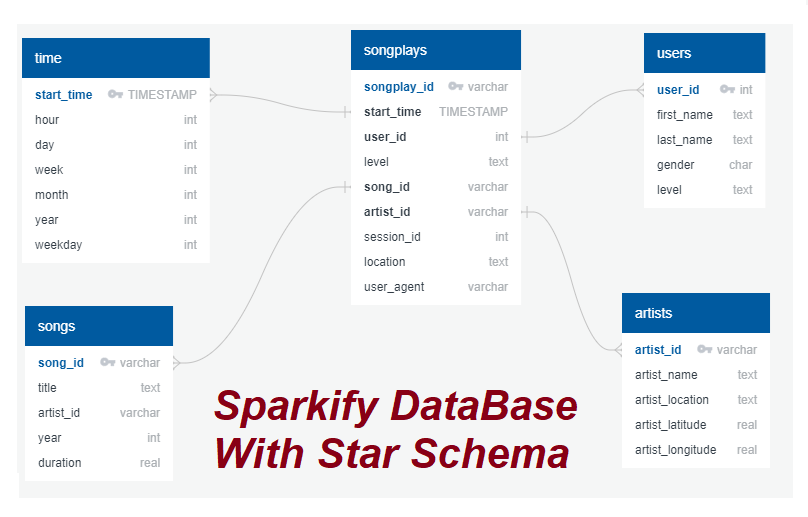

# Project: Data Modeling with Postgres

## Abstract
Analysis user songs of Sparkify by applying data modeling with Postgres and build an ETL pipeline using Python.

## Introduction
A startup called Sparkify wants to analyze the data they've been collecting on songs and user activity on their new music streaming app. The analytics team is particularly interested in understanding what songs users are listening to. Currently, they don't have an easy way to query their data, which resides in a directory of JSON logs on user activity on the app, as well as a directory with JSON metadata on the songs in their app.

They'd like a data engineer to create a Postgres database with tables designed to optimize queries on song play analysis, and bring you on the project. our role is to create a database schema and ETL pipeline for this analysis. You'll be able to test our database and ETL pipeline by running queries given to you by the analytics team from Sparkify and compare our results with their expected results.
## problem Definition
In this project, We'll apply data modeling with Postgres and build an ETL pipeline using Python. To complete the project, We need to define fact and dimension tables for a star schema for a particular analytic focus, and write an ETL pipeline that transfers data from files in two local directories into these tables in Postgres using Python and SQL.

## Song Dataset
The first dataset is a subset of real data from the Million Song Dataset. Each file is in JSON format and contains metadata about a song and the artist of that song. The files are partitioned by the first three letters of each song's track ID. For example, here are filepaths to two files in this dataset.

    song_data/A/B/C/TRABCEI128F424C983.json
    song_data/A/A/B/TRAABJL12903CDCF1A.json

And below is an example of what a single song file, TRAABJL12903CDCF1A.json, looks like.

    {"num_songs": 1, "artist_id": "ARJIE2Y1187B994AB7", "artist_latitude": null, "artist_longitude": null, "artist_location": "", "artist_name": "Line Renaud", "song_id": "SOUPIRU12A6D4FA1E1", "title": "Der Kleine Dompfaff", "duration": 152.92036, "year": 0}```


    # Log Dataset
    The second dataset consists of log files in JSON format generated by this [event simulator](https://github.com/Interana/eventsim) based on the songs in the dataset above. These simulate activity logs from a music streaming app based on specified configurations.

    The log files in the dataset you'll be working with are partitioned by year and month. For example, here are filepaths to two files in this dataset.

txt \
log_data/2018/11/2018-11-12-events.json \
log_data/2018/11/2018-11-13-events.json \
......

And below is an example of what the data in a log file, 2018-11-12-events.json, looks like.


## Schema for Song Play Analysis
 Using the song and log datasets, you'll need to create a star schema optimized for queries on song play analysis. This includes the following tables.

### Fact Table
1. <h3>songplays</h3> - records in log data associated with song plays i.e. records with page NextSong
 - Column 1: songplay_id
 - Column 2: start_time
 - Column 3: user_id
 - Column 4: level
 - Column 5: song_id
 - Column 6: artist_id
 - Column 7: session_id
 - Cloumn 8: location
 - Cloumn 9: user_agent

### Dimension Tables
2. <h3>users</h3> - users in the app
 - Column 1: user_id
 - Column 2: first_name
 - Column 3: last_name
 - Column 4: gender
 - Column 5: level
3. <h3>songs </h3>- songs in music database
- Column 1: song_id
- Column 2: title
- Column 3: artist_id
- Column 4: year
- Column 5: duration
4. <h3>artists</h3> - artists in music database
- Column 1: artist_id
- Column 2: name
- Column 3: location
- Column 4: latitude
- Column 5: longitude
5. <h3>time</h3> - timestamps of records in songplays broken down into specific units
- Column 1: start_time
- Column 2: hour
- Column 3: day
- Column 4: week
- Column 5: month
- Column 6: year
- Column 7: weekday

## Project Template
In addition to the data files, the project workspace includes six files:

1. test.ipynb displays the first few rows of each table to let you check our database.
2. create_tables.py drops and creates our tables. You run this file to reset our tables before each time you run our ETL scripts.
3. etl.ipynb reads and processes a single file from song_data and log_data and loads the data into our tables. This notebook contains detailed instructions on the ETL process for each of the tables.
4. etl.py reads and processes files from song_data and log_data and loads them into our tables. You can fill this out based on our work in the ETL notebook.
5. sql_queries.py contains all our sql queries, and is imported into the last three files above.
6. README.md provides discussion on our project.

## Implementation
### Create Tables
1. Write CREATE statements in sql_queries.py to create each table.
2. Write DROP statements in sql_queries.py to drop each table if it exists.
3. Run create_tables.py to create your database and tables.
4. Run test.ipynb to confirm the creation of your tables with the correct columns. Make sure to click "Restart kernel" to close the connection to the database after running this notebook.

### Build ETL Processes
Follow instructions in the etl.ipynb notebook to develop ETL processes for each table. At the end of each table section, or at the end of the notebook, run test.ipynb to confirm that records were successfully inserted into each table. Remember to rerun create_tables.py to reset your tables before each time you run this notebook.

### Build ETL Pipeline
 To run create_tables.py before running etl.py to reset your tables. Run test.ipynb to confirm your records were successfully inserted into each table.

And below is the songs ERD.
